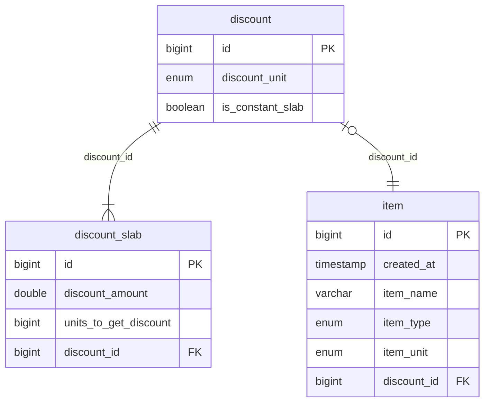

# Payaut REST service

| ID   | CREATED_AT          | ITEM_NAME    | ITEM_PRICE   | ITEM_TYPE   | ITEM_UNIT   | DISCOUNT_ID   |
|------|---------------------|--------------|--------------|-------------|-------------|---------------|
| 1    | 2024-04-24 10:00:00 | Vegetables   | 0.01         | VEGETABLES  | GRAM        | 1             |
| 2    | 2024-04-24 11:00:00 | Dutch Beer   | 0.5          | BEERS       | PIECE       | 2             |
| 3    | 2024-04-25 11:00:00 | Bread        | 1.0          | BREADS      | PIECE       | 3             |
| 4    | 2024-04-24 11:00:00 | Belgium Beer | 0.75         | BEERS       | PIECE       | 4             |
| 5    | 2024-04-24 11:00:00 | German Beer  | 1.0          | BEERS       | PIECE       | 5             |

